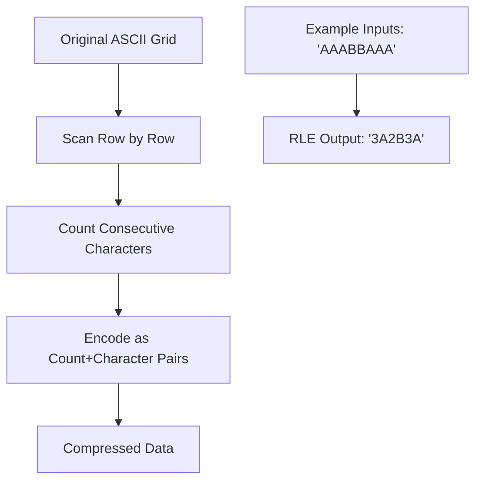
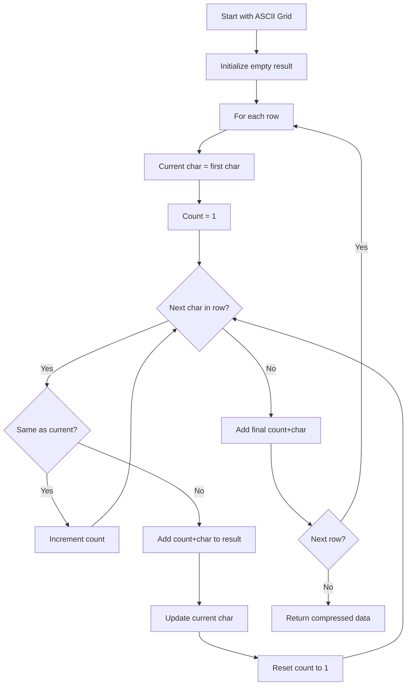
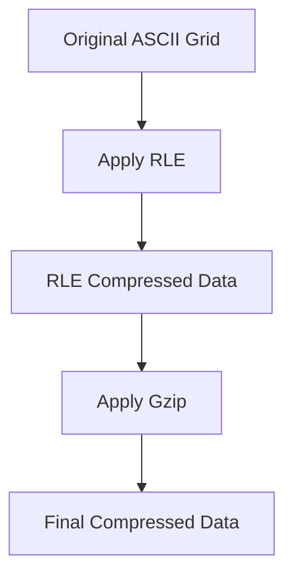
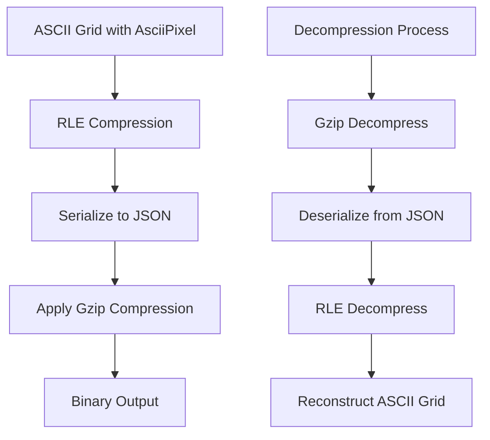
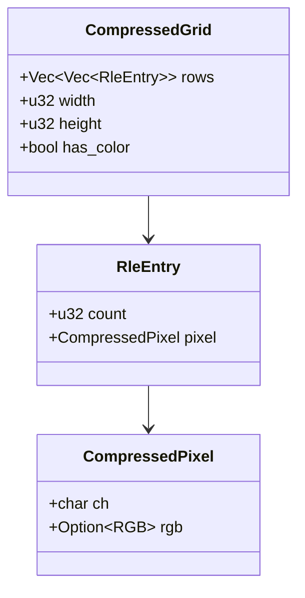

# Compression of ASCII Grid

## Overview

The compression module provides efficient compression techniques specifically designed for ASCII art generated by the image-to-ASCII converter. Since ASCII art often contains repeated characters and patterns, compression can significantly reduce the size of the output data, esecially for large images.

The module achieves high compression ratios, often between 85-99%.

## Compression Methods

### 1. Run-Length Encoding (RLE)

Run-Length Encoding is particularly effective for ASCII art because:
- ASCII art often has long sequences of the same character (e.g., background spaces).
- Both color and grayscale ASCII art exhibit pattern repetition.
- Simple to implement and decode.
- Low computational overhead.

#### How RLE Works



#### RLE Algorithm Flow



### 2. Gzip Compression

After RLE preprocessing, gzip compression provides additional benefits:
- Handles remaining patterns that RLE doesn't catch.
- Industry-standard compression algorithm.
- Excellent compression ratios for text-based data.
- Built-in error detection and correction.
- Widely supported across platforms.

### Why RLE + Gzip is Optimal?

The combination of RLE followed by gzip creates a powerful two-stage compression process:



#### Compression Pipeline



## Data Structures

### AsciiPixel Compression

The compression handles both character and optional RGB color data:

```rust
#[derive(Serialize)]
pub struct AsciiPixel {
    pub character: char,
    pub color: Option<[u8; 3]>,
}
```

### RLE Data Structures



### Module Structure

```
src/compressor/
├── mod.rs              # Public interface and main compression function
├── gzip.rs             # Gzip compression wrapper and JSON serialization
├── tests.rs            # Comprehensive test suite
└── rle/
    ├── mod.rs          # RLE module exports
    ├── compress.rs     # RLE compression implementation
    ├── decompress.rs   # RLE decompression (test-only)
    └── types.rs        # RLE data structures and errors
```

## Implementation Details

### Main Compression Interface

The [`compress_ascii_grid`](backend/src/compressor/mod.rs) function provides the complete pipeline:

```rust
pub fn compress_ascii_grid(grid: &[Vec<AsciiPixel>]) -> Result<Vec<u8>, Box<dyn std::error::Error>> {
    // Stage 1: RLE compression
    let rle_compressed = rle::compress_grid(grid)?;
    
    // Stage 2: Serialize RLE data to JSON
    let serialized = gzip::serialize_compressed_grid(&rle_compressed)?;
    
    // Stage 3: Gzip compression
    let final_compressed = gzip::compress(&serialized)?;
    
    Ok(final_compressed)
}
```

### RLE Compression Features

- **Color-aware compression**: Doesn't compress across color boundaries.
- **Row-by-row processing**: Maintains grid structure.
- **Efficient for repetitive patterns**: Single characters can compress to 1 entry.
- **Handles edge cases**: Empty grids, single pixels, alternating patterns.

### Gzip Integration

- **JSON serialization**: Uses `serde_json` for cross-platform compatibility.
- **Error handling**: Comprehensive error types for debugging.
- **Test-only decompression**: Decompression functions available for testing.

## Performance Analysis

Based on examples from manual testing, collected by backend.log:

| Original Size | Compressed Size | Compression Ratio | Pattern Type |
|---------------|----------------|-------------------|--------------|
| 325,749 bytes | 5,457 bytes    | 98.3%            | High repetition |
| 2,024,369 bytes | 26,809 bytes | 98.7%            | High repetition |
| 8,096,737 bytes | 91,269 bytes | 98.9%            | High repetition |
| 427,877 bytes | 56,149 bytes   | 86.9%            | Mixed patterns |
| 10,633,647 bytes | 1,345,382 bytes | 87.3%         | Complex images |

### Performance Characteristics

- **Best case**: 98.9% compression for highly repetitive ASCII art.
- **Typical case**: 87-98% compression for most images.
- **Worst case**: Still achieves 86.9% compression for complex patterns.

## Testing Strategy

### Comprehensive Test Coverage

The [`tests.rs`](backend/src/compressor/tests.rs) file includes:

#### RLE Tests
- Simple compression patterns
- Color boundary preservation
- Mixed color patterns
- Alternating patterns (no compression)
- Large datasets (10,000+ characters)
- Empty grids and edge cases

#### Gzip Tests
- Basic compression/decompression
- Repetitive data (high compression)
- Random data (low compression)
- Large datasets
- ASCII art patterns

#### Combined Pipeline Tests
- Two-stage compression
- Metadata preservation
- Color data integrity
- Large grid scalability
- End-to-end roundtrip testing

#### Integration Tests
- Real-world ASCII art patterns
- Colored ASCII art
- Mixed pattern types
- Complete compression pipeline

### Test Results

All tests pass with 100% success rate, validating:
- ✅ Compression/decompression roundtrip accuracy
- ✅ Color data preservation
- ✅ Metadata integrity
- ✅ Error handling
- ✅ Performance with large datasets

## Frontend Integration

The frontend seamlessly handles both compressed and uncompressed data responses from the backend, providing automatic decompression when needed.

### Compression Detection

The frontend detects compressed responses through HTTP headesr:

```typescript
// Check if response is compressed
const contentType = response.headers.get('content-type');
const compression = response.headers.get('x-compression');

// Handle compressed vs uncompressed responses
if (contentType === 'application/octet-stream' || (compression && compression.startsWith('rle-gzip'))) {
    // Handle compressed response
    const compressedData = await response.arrayBuffer();
    asciiGrid = await decompressData(compressedData);
} else if (contentType && contentType.includes('application/json')) {
    // Handle uncompressed JSON response
    asciiGrid = await response.json();
}
```

### Decompression Pipeline

The frontend implements a two-stage decompression process that mirrors the backend compression:

```typescript
// Stage 1: Gzip decompression using pako library
async function decompressData(compressedData: ArrayBuffer): Promise<any> {
    const compressed = new Uint8Array(compressedData);
    
    // Decompress using pako (JavaScript gzip implementation)
    const decompressed = pako.inflate(compressed);
    
    // Convert to string and parse JSON
    const jsonString = new TextDecoder().decode(decompressed);
    const rleData = JSON.parse(jsonString);
    
    // Stage 2: RLE decompression
    return decompressRleData(rleData);
}
```

### RLE Decompression Implementation

```typescript
function decompressRleData(rleData: any): any[][] {
    const result = [];
    
    for (const row of rleData.rows) {
        const decompressedRow = [];
        
        for (const entry of row) {
            // Expand RLE entry: repeat pixel 'count' times
            for (let j = 0; j < entry.count; j++) {
                decompressedRow.push(entry.pixel);
            }
        }
        
        result.push(decompressedRow);
    }
    
    return result;
}
```

### HTTP Response Headers

The backend provides compression metadata through custom headers:

| Header | Description | Example |
|--------|-------------|---------|
| `X-Compression` | Compression method and statistics | `rle-gzip;original=325749;compressed=5457;percentage=98.3` |
| `X-Original-Size` | Original ASCII grid size in bytes | `325749` |
| `X-Compressed-Size` | Compressed data size in bytes | `5457` |
| `Content-Type` | Response format indicator | `application/octet-stream` |

### Error Handling

The frontend includes comprehensive error handling for decompression:

```typescript
try {
    // Decompression process
    const decompressed = pako.inflate(compressed);
    const jsonString = new TextDecoder().decode(decompressed);
    const rleData = JSON.parse(jsonString);
    
    // Validate structure
    if (!rleData.rows || !Array.isArray(rleData.rows)) {
        throw new Error('Invalid RLE data structure - missing rows array');
    }
    
    return decompressRleData(rleData);
} catch (error) {
    console.error('Decompression error:', error);
    throw error;
}
```

### Frontend Dependencies

The frontend uses the `pako` library for gzip decompression:

```bash
npm install pako
npm install --save-dev @types/pako
```

### Performance Benefits

The compression integration provides significant performance improvements:

- **Reduced bandwidth**: 86.9% to 98.9% reduction in data transfer
- **Faster load times**: Especially beneficial for large ASCII art (200x100+ characters)
- **Improved user experience**: Faster rendering of complex ASCII art
- **Mobile optimization**: Reduced data usage on mobile networks

This integration ensures that users benefit from compression automatically while maintaining a seamless experience across all device types and network conditions.