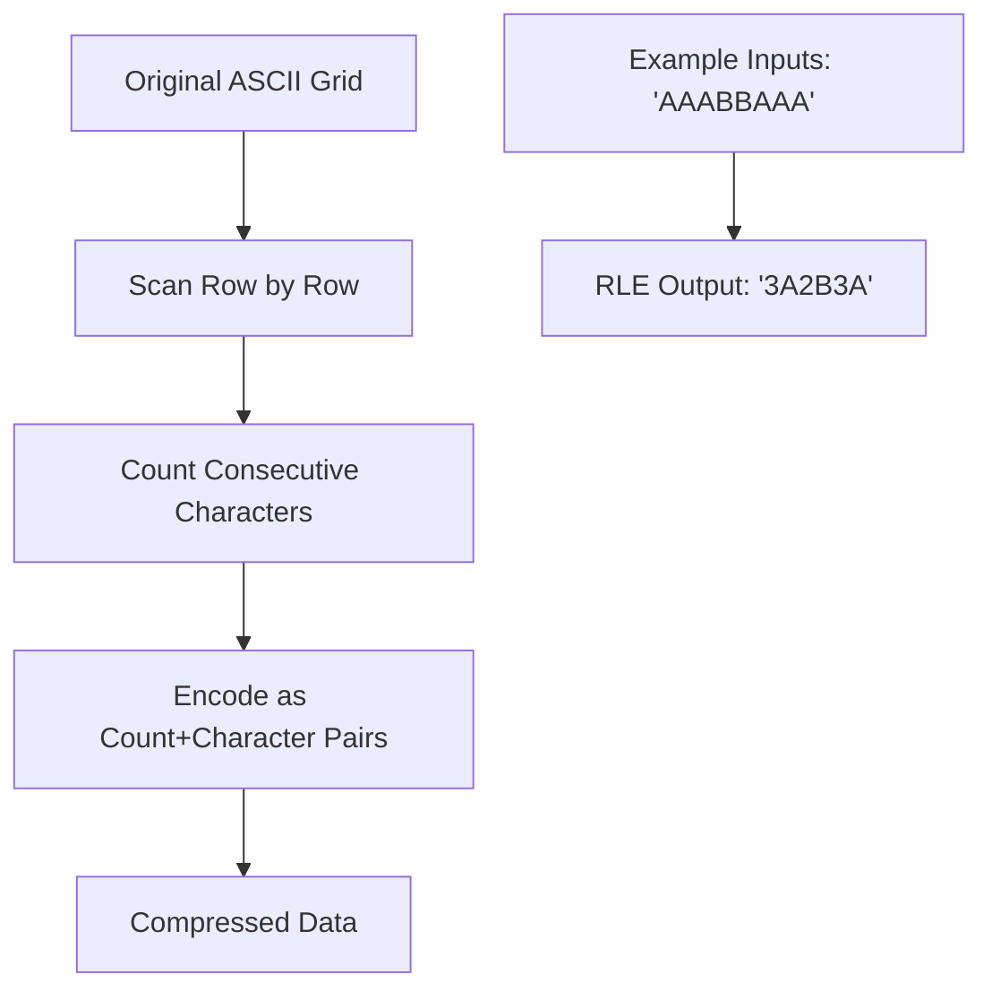
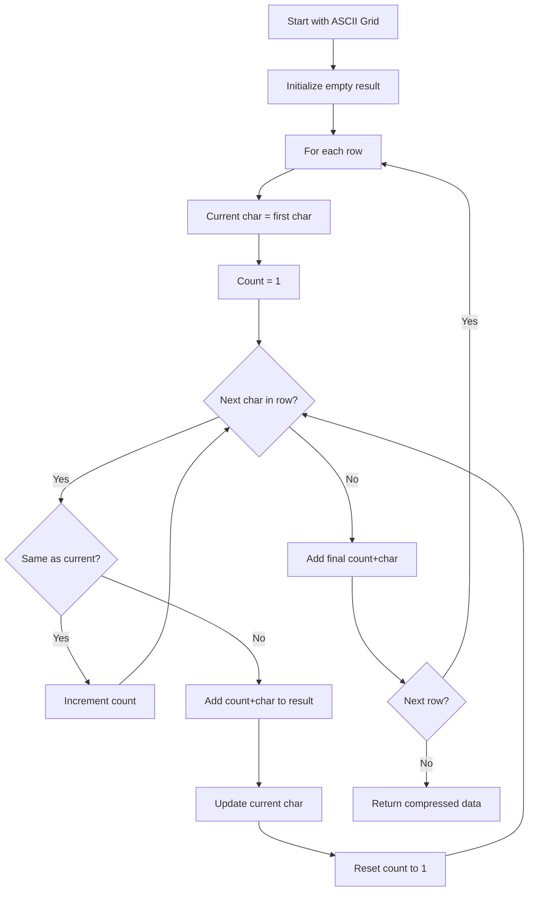
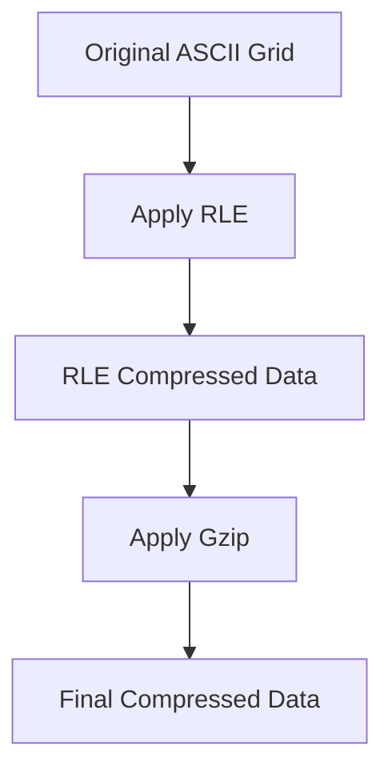
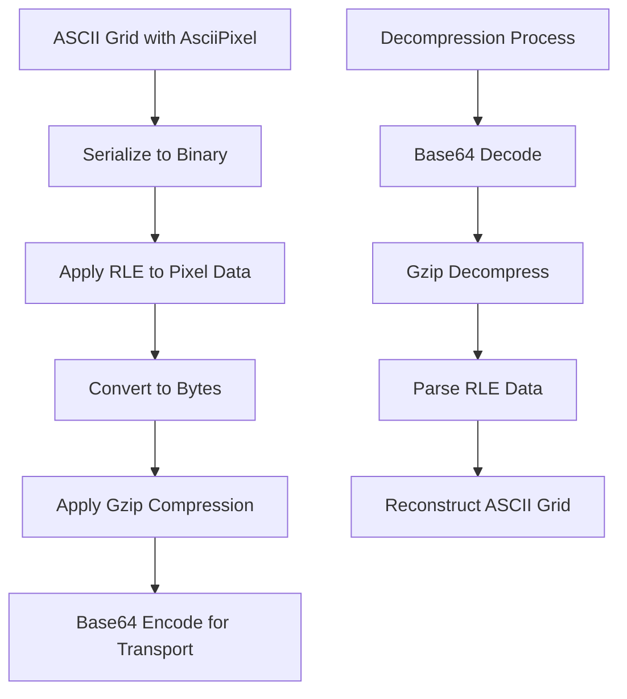
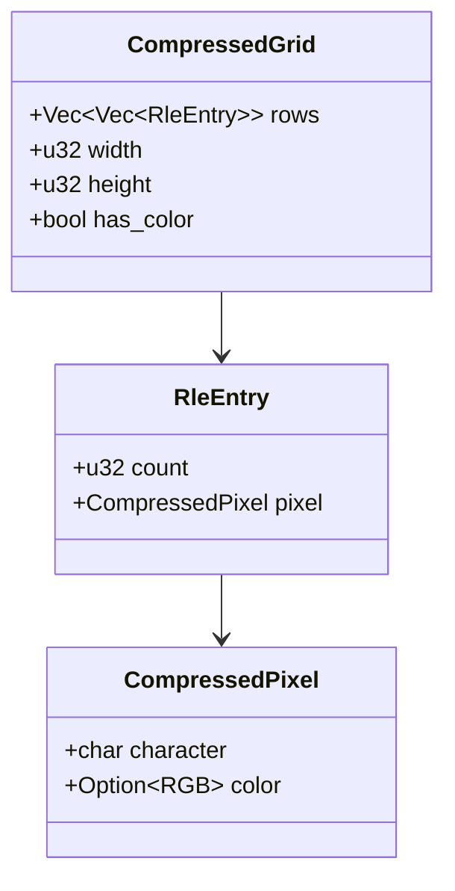

# Compression of ASCII Grid

## Overview

The compression module provides efficient compression techniques specifically designed for ASCII art generated by the image-to-ASCII converter. Since ASCII art often contains repeated characters and patterns, compression can significantly reduce the size of the output data, esecially for large images.

## Compression Methods

### 1. Run-Length Encoding (RLE)

Run-Length Encoding is particularly effective for ASCII art because:
- ASCII art often has long sequences of the same character (e.g., background spaces).
- Both color and grayscale ASCII art exhibit pattern repetition.
- Simple to implement and decode.
- Low computational overhead.

#### How RLE Works



#### RLE Algorithm Flow



### 2. Gzip Compression

After RLE preprocessing, gzip compression provides additional benefits:
- Handles remaining patterns that RLE doesn't catch.
- Industry-standard compression algorithm.
- Excellent compression ratios for text-based data.
- Built-in error detection and correction.
- Widely supported across platforms.

### Why RLE + Gzip is Optimal?

The combination of RLE followed by gzip creates a powerful two-stage compression process:



#### Compression Pipeline



## Data Structures

### AsciiPixel Compression

Since the `AsciiPixel` struct contains both character and optional RGB color:

```rust
#[derive(Serialize)]
pub struct AsciiPixel {
    pub character: char,
    pub color: Option<[u8; 3]>,
}
```

We handl ecompression in two phases:



### Module Structure

```
src/compression/
├── mod.rs              # Public interface
├── rle.rs              # Run-length encoding
├── gzip.rs             # Gzip compression wrapper
└── error.rs            # Compression-specific errors
```

## Implementation Plan

- [ ] Phase 1: RLE Implementation
- [ ] Phase 2: Gzip Integration
- [ ] Phase 3: Combined Pipeline

## Performance Analysis

### Compression Ratios

### Performance Benchmarks

## Testing Strategy

### Unit Tests

### Integration Tests

## Frontend Integration