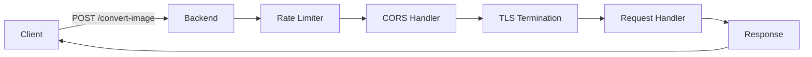

# API Endpoint Details

The backend exposes a single REST API endpoint for the image-to-ASCII conversion with comprehensive request handling and validation.

## Endpoint Overview

### POST `/convert-image`

Converts uploaded images to ASCII art with customizable parameters.



## Example Request (cURL)

```bash
curl -X POST https://your-server:8444/convert-image \
  -F "image=@example.jpg" \
  -F 'config={"output_width":100,"is_color":true}'
```

## Example Request (JavaScript/Fetch)

```javascript
const formData = new FormData();
formData.append('image', fileInput.files[0]);
formData.append('config', JSON.stringify({
  output_width: 200,
  output_height: 100,
  is_color: true,
  brightness_factor: 1.2
}));

const response = await fetch('https://your-server:8444/convert-image', {
  method: 'POST',
  body: formData
});

const asciiGrid = await response.json();
```

## Security Considerations

- **TLS Only:** All communication encrypted.
- **Rate Limiting:** Prevents DoS attacks.
- **Input Validation:** Comprehensive config validation.
- **Memory Bounds:** Implicit limits through timeouts and memory constraints.
- **No File Storage:** Images processed in memory only.

This API design provides a robust, secure, and efficient interface for image-to-ASCII conversion while maintaining simplicity for client integration.