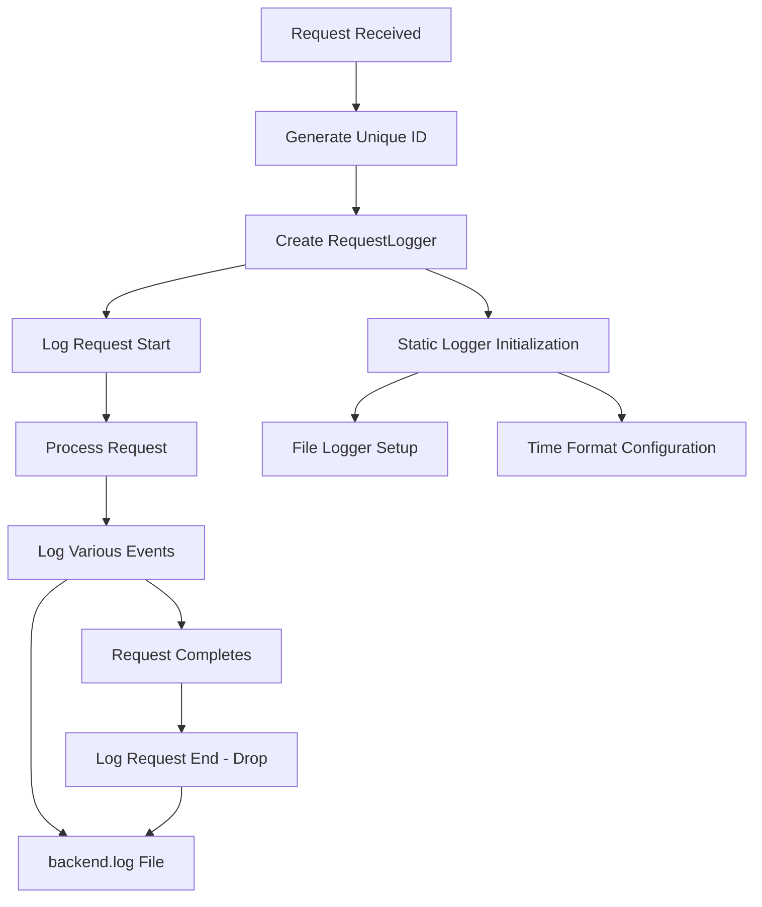

# Request Logging System

The backend implements a comprehensive loggin system that tracks individual requests with unique IDs and provides detailed audit trails.

## Architecture



## Log Format

### Time Format
- **Pattern**: `[day]/[month]/[year] [hour]:[minute]:[second]`.
- **Example**: `09/07/2025 14:30:45`.
- **Timezone**: Local time (configured for NZT).

## Log Entry Structure
```
[TIMESTAMP] [LEVEL] [MESSAGE]
```

### Example Log Output
```
09/07/2025 14:30:45 [INFO] ------------------- [Request 1752046659555] Start -------------------
09/07/2025 14:30:45 [INFO] [1752046659555] Received request to /convert-image
09/07/2025 14:30:45 [INFO] [1752046659555] Config received: {"character_set":[" ",".",":","-","=","+","*","#","%","@"],"output_width":200,"output_height":100,"brightness_factor":1.0,"contrast_factor":1.0,"is_color":false,"aspect_ratio_correction":0.55}
09/07/2025 14:30:46 [INFO] [1752046659555] Image converted successfully
09/07/2025 14:30:46 [INFO] ------------------- [Request 1752046659555] End ---------------------
```

## Key Features

### Singleton Initialization
Uses `OnceLock` to ensure logger is initialized only once across the application lifetime.

### Automatic Request Lifecycle Tracking
- **Start:** Logged when `RequestLogger::new()` is called.
- **End:** Logged automatically when logger is dropped.
  
### Request ID Generation
- Uses current timestamp in milliseconds.
- Provides unique identification for each request.
- Enanles correlation of log entries across request lifecycle.

### Structured Logging
Different log levels for different types of events:
- **INFO:** Normal operation events, status updates.
- **ERROR:** Error conditions, failures.