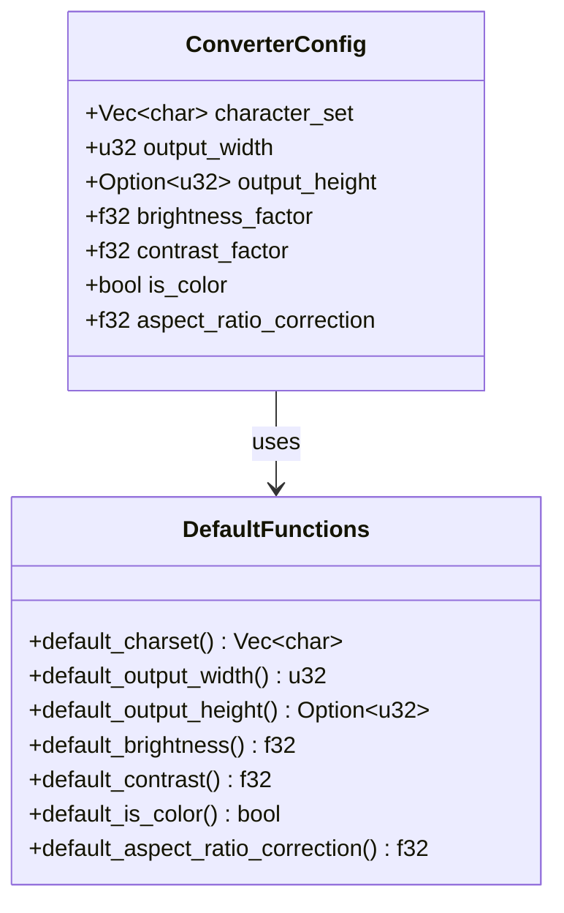

# Configuration System

The backend uses a flexible configuration system built with Serde for JSON serialization/deserialization with defaults.

## Configuration Structure



## Example Configurations

### Minimal Configuration
```json
{
  "output_width": 100
}
```
All other values use defaults.

### Full Configuration
```json
{
  "character_set": [" ", ".", ":", "-", "=", "+", "*", "#", "%", "@"],
  "output_width": 200,
  "output_height": 100,
  "brightness_factor": 1.2,
  "contrast_factor": 0.8,
  "is_color": true,
  "aspect_ratio_correction": 0.55
}
```

### Color Configuration
```json
{
  "output_width": 150,
  "is_color": true,
  "brightness_factor": 1.1,
  "character_set": [" ", "█"]
}
```