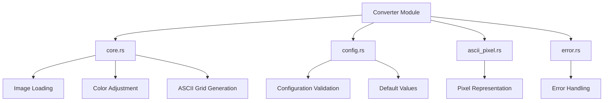
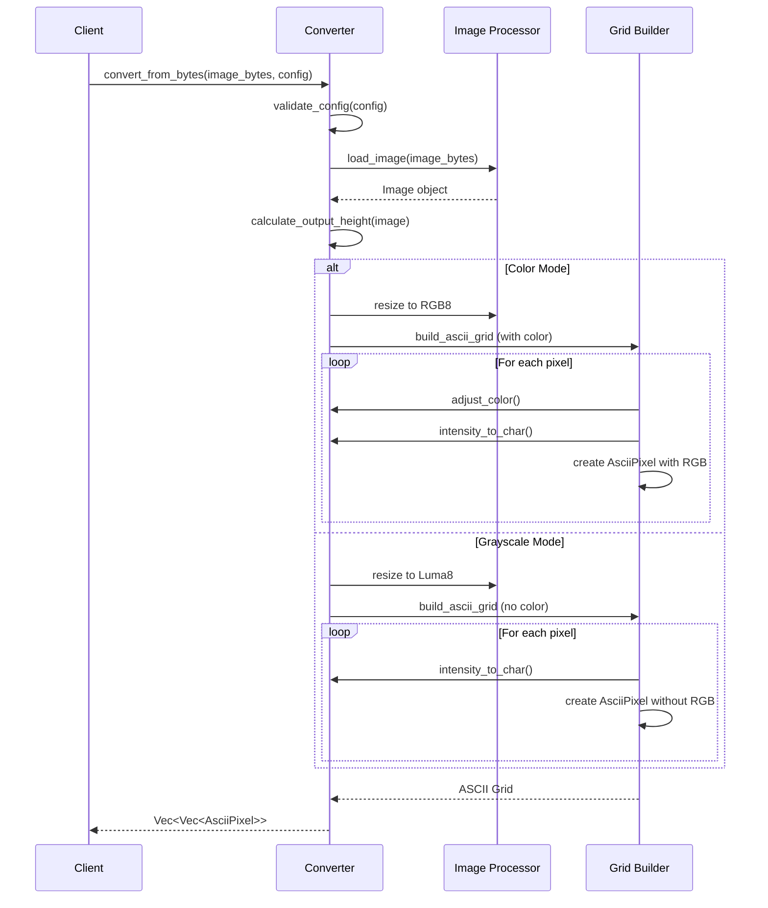

# Converter Module

The converter module handles the core image processing and ASCII conversion logic. It's structured as a modular system with clear separation of concerns.

## Module Structure

## Core Conversion Process

## Key Functions

### `convert_from_bytes()`
Main entry point that orchestrates the entire conversion process.

1. **Validation** - Ensures configuration parameters are valid.
2. **Image Loading** - Loads image from memory using the `image` crate.
3. **Dimension Calculation** - Calculates output height if not specified.
4. **Processing Branch** - Chooses color or grayscale processing path based on configuration.
5. **Grid Generation** - Builds the final ASCII grid.