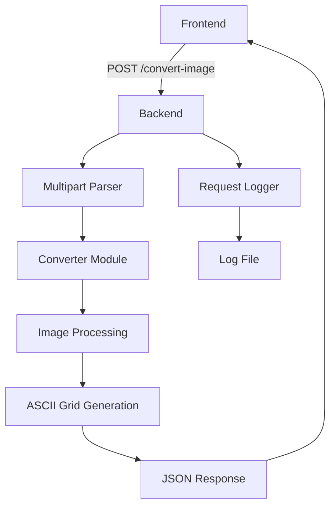

# Backend Architecture

The Pixcha backend is built in Rust using the [rusty-api](https://crates.io/crates/rusty-api) framework. It provides a single endpoint for converting images to ASCII art with extensive customization options.

## Overview

The backend consists of several key modules:

- **Main Server** ([`main.rs`](../../../backend/src/main.rs)) - Entry point, routing, and request handling.
- **Converter Module** ([`converter/`](../../../backend/src/converter/)) - Core image processing logic.
- **Request Logger** ([`request_logger.rs`](../../../backend/src/request_logger.rs)) - Request tracking and logging.

## High-Level Architecture

## Key Features

- **TLS Support** -Secure HTTPS communication with custom self-signed certificates.
- **CORS Configuration** - Cross-origin requests from frontend.
- **Rate Limiting** - Protection against abuse (3 requests per 20 seconds).
- **Request Logging** - Detailed loggin with unique request IDs.
- **Multipart Form Handling** - Support for image uploads with configuration.
- **Color ASCII Art** - Optional colored output with RGB values.
- **Multiple Character Sets** - Standard, simple, and complex character mappings.

## API Endpoint

### POST `/convert-image`

Converts an uploaded image to ASCII art based on provided configuration.

**Content-Type:** `multipart/form-data`

**Form Fields:**
- `image` (File) - The image file to convert.
- `config` (JSON String) - Configuration object.

**Response:** JSON array representing the ASCII grid.