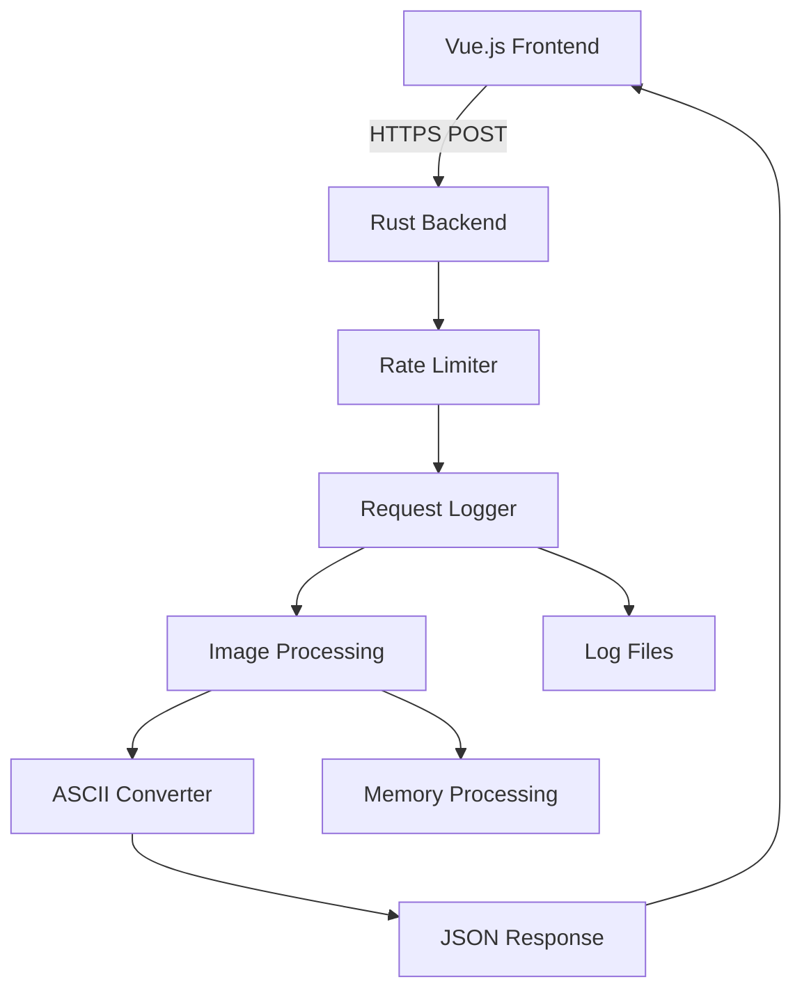

# Pixcha (image-to-ASCII)

An image-to-ASCII converter with a web interface and powerful backend processing capabilities.

## Overview

Pixcha allows you to convert images into ASCII art with extensive customization options. The project consists of a Vue.js frontend hosted on GitHub Pages and a Rust backend running on a Raspberry Pi server.

## Features

### 🎨 **Rich ASCII Conversion**
- **Color Support**: Optional colored ASCII output with RGB values.
- **Multiple Character Sets**: Choose from standard, simple, or complex character mappings.
- **Customizable Dimensions**: Control output width/height with aspect ratio correction.
- **Brightness & Contrast**: Fine-tune image processing with parameters.

### 🔒 **Secure & Robust Backend**
- **TLS/HTTPS**: Secure communication with self-signed certificates.
- **Rate Limiting**: Protection against abuse (3 requests per 20 seconds).
- **CORS Configuration**: Proper cross-origin request handling.
- **Request Logging**: Detailed audit trails with unique request IDs.

### 🚀 **Modern Architecture**
- **Frontend**: Vue.js with TypeScript.
- **Backend**: Rust with [rusty-api](https://crates.io/crates/rusty-api)
- **CI/CD**: GitHub Actions for automated testing.
- **Deployment**: GitHub Pages (frontend) and Raspberry Pi (backend).

## Quick Start

### Frontend Development

```bash
cd frontend
npm install
npm run serve
```

### Backend Development

```bash
cd backend
cargo build
cargo run
```

### Running Tests

```bash
cd backend
cargo test
```

## API Usage

### Endpoint

**POST** `https://your-server:port/convert-image`

### Example Request

```bash
curl -X POST https://your-server:port/convert-image \
  -F "image=@example.jpg" \
  -F 'config={"output_width":100,"is_color":true}'
```

### Configuration Options

```json
{
  "character_set": [" ", ".", ":", "-", "=", "+", "*", "#", "%", "@"],
  "output_width": 200,
  "output_height": 100,
  "brightness_factor": 1.2,
  "contrast_factor": 0.8,
  "is_color": true,
  "aspect_ratio_correction": 0.55
}
```

## Architecture



## Project Structure

```
├── frontend/           # Vue.js application
│   ├── src/           # Source code
│   ├── public/        # Static assets
│   └── package.json   # Dependencies
├── backend/           # Rust server
│   ├── src/          # Source code
│   │   ├── converter/ # Image processing logic
│   │   ├── main.rs   # Server entry point
│   │   └── request_logger.rs # Logging system
│   └── Cargo.toml    # Dependencies
├── docs/             # Documentation
└── .github/workflows/ # CI/CD configuration
```

## Deployment

### Frontend (GitHub Pages)
```bash
cd frontend
npm run build
# Deploy dist/ folder to GitHub Pages
```

### Backend (Raspberry Pi)
```bash
cd backend
cargo build --release
# Copy target/release/backend to Pi
# Set up systemd service for automatic startup
```

## Documentation

Comprehensive documentation is available in the [`docs/`](docs/) directory:

- **[Backend Architecture](docs/backend/backend.md)**: Complete backend overview
- **[API Documentation](docs/backend/backend.api.md)**: Endpoint details and examples  
- **[Converter Module](docs/backend/backend.converter.md)**: Image processing internals
- **[Logging System](docs/backend/backend.logging.md)**: Request tracking and audit trails
- **[Configuration](docs/backend/backend.configuration.md)**: Setup and customization options

## Contributing

1. Fork the repository
2. Create a feature branch (`git checkout -b feature/amazing-feature`)
3. Make your changes
4. Run tests (`cargo test` for backend, `npm test` for frontend)
5. Commit your changes (`git commit -m 'Add amazing feature'`)
6. Push to the branch (`git push origin feature/amazing-feature`)
7. Open a Pull Request

## Support

For issues, feature requests, or questions, please open an issue on GitHub or contact the project maintainers.